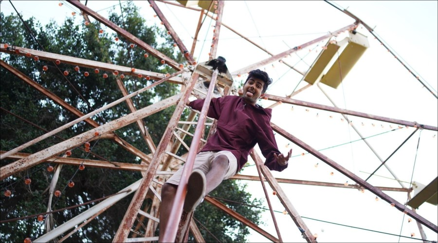

# LAB1-CSE110
# Dillan's User Page
# C++

# This is the largest heading
## This is the second largest heading
###### This is the smallest heading

### Styling text:
This sentence will cover the styling texts: **this is bold**, *this is italicized*, ~~this is crossed out~~, ***bolded and italicized***, **bolded but _this is italicized_** ... isn't that cool?!

### A cool quote (Quoting Text): 
> When you reach the end of your rope, tie a knot in it and hang on

### Quoting code:
This command allows you to go to a certain branch: `git checkout`

### Links: 
I can link my own [personal website](https://dillanmerchant.github.io/website/)

### Lists: 
- Waffles 
- Pancakes 
- Eggs

### Task Lists: 
- [x] Finish Lab 1 
- [ ] Get an A in CSE 110 
- [ ] Graduate

### Seciton Link:
[Go to top](#LAB1-CSE110)

### Relative Link:
[Click on this for full view of my picture](./picture/Slide3.jpg)
